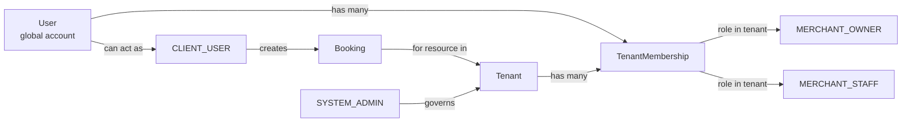

# booking-core 角色關係文件

## 1. 目的

- 提供單一、可快速閱讀的角色關係說明。
- 對齊前端路由、後端 API 權限、資料隔離邊界。
- 作為 PM、FE、BE、QA、Reviewer 的共同參考基準。

## 2. 角色清單

- `CLIENT_USER`：平台客戶使用者。
- `MERCHANT_OWNER`：商戶擁有者（租戶管理主責）。
- `MERCHANT_STAFF`：商戶成員（受限操作）。
- `SYSTEM_ADMIN`：平台系統管理者。

> 現況程式角色仍為 `CLIENT | MERCHANT | ADMIN`。整合階段建議映射為：  
> `CLIENT -> CLIENT_USER`、`MERCHANT -> MERCHANT_OWNER`、`ADMIN -> SYSTEM_ADMIN`。

## 3. 角色關係（核心觀念）

- `CLIENT_USER` 與 `MERCHANT_*` 是平行關係，非上下屬。
- `MERCHANT_OWNER` 與 `MERCHANT_STAFF` 同屬商戶租戶（tenant-scoped）。
- `SYSTEM_ADMIN` 屬平台層（global scope），負責治理，不屬於特定商戶租戶。
- 角色間主要透過 `Booking` 發生業務關聯。

## 4. 關係圖（概念）

```text
Platform
  ├─ SYSTEM_ADMIN (global)
  ├─ CLIENT_USER (platform user)
  └─ Tenant (Merchant)
       ├─ MERCHANT_OWNER
       ├─ MERCHANT_STAFF (optional)
       ├─ ServiceTeam (1..N)
       ├─ Resource (1..N)
       └─ Booking (links CLIENT_USER <-> Tenant Resource/Slot)
```

### 4.1 角色關係圖（資料模型視角）



### 4.2 圖解說明（角色關係）

- `User` 是全域登入主體，一個帳號可同時擁有多種身分。
- `TenantMembership` 是關鍵：定義「哪個 user 在哪個 tenant 是什麼角色」。
- `MERCHANT_OWNER`、`MERCHANT_STAFF` 都是 tenant 內角色，不是全域角色。
- `CLIENT_USER` 是同一個 user 在客戶側的使用身分，可獨立於 tenant 存在。
- `Booking` 連接 `CLIENT_USER` 與 `Tenant` 內的資源/時段，是雙方主要業務關聯。
- `SYSTEM_ADMIN` 管理平台治理能力，但不改變 tenant 隔離規則。

## 5. 租戶與資料邊界

- `MERCHANT` 與 `TENANT` 關係：`Tenant 1 -> N Merchant Users`。
- 每個 `MERCHANT` 必須且只能歸屬一個 `tenant_id`（不可為空、不可多租戶同時歸屬）。
- 每個 `TENANT` 至少應有一位 `MERCHANT_OWNER`（避免無主租戶）。
- `MERCHANT_OWNER`/`MERCHANT_STAFF`：所有查寫必須強制 `tenant_id` 範圍。
- `CLIENT_USER`：只能看/改自己的 `profile` 與自己的 `bookings`。
- `SYSTEM_ADMIN`：可看平台治理資料（tenants/users/roles/audit），不可預設跨權代商戶日常操作。

### `MERCHANT` 與 `TENANT` 關係補充

- 名詞對照：
  - `TENANT` = 商戶組織邊界（資料隔離單位）
  - `MERCHANT` = 租戶中的人員角色（owner/staff）
- 關係型態：
  - `TENANT 1 --- N MERCHANT`
  - `MERCHANT N --- 1 TENANT`
- 實作規則：
  - 商戶端 API 查寫一律以後端安全上下文注入 `tenant_id` 做篩選。
  - 若 `MERCHANT` 嘗試存取非本 `tenant_id` 資料，必須回 `403`。
  - `SYSTEM_ADMIN` 可管理 tenant 與 merchant 帳號，但不改變上述租戶隔離規則。

## 6. 角色能力摘要

### `CLIENT_USER`

- 可：搜尋服務、查可用時段、下訂、查看/取消/改期自己的預約、維護個資。
- 不可：管理商戶資源、排程、平台治理資料。

### `MERCHANT_OWNER`

- 可：管理資源、排程規則/例外、處理預約狀態、商戶設定、團隊與權限。
- 不可：跨租戶操作、平台治理功能。

### `MERCHANT_STAFF`

- 可（授權內）：查看與處理預約、查看資源與排程。
- 不可（預設）：高風險設定、團隊權限管理、owner 管理。

### `SYSTEM_ADMIN`

- 可：租戶管理、平台使用者管理、角色權限、稽核日誌。
- 不可（預設）：直接執行商戶日常業務操作（除非有審計化代操作機制）。

## 7. 商戶可否多服務隊

**可以，且建議支援。**

- 建議模型：
  - `Tenant 1 --- N ServiceTeam`
  - `ServiceTeam 1 --- N TeamMember`
  - `ServiceTeam 1 --- N Resource`（或 Resource 多對多 team）
- 好處：
  - 可依部門/專長分工與排班。
  - 支援多服務線與後續多據點擴展。
  - 提升權限控管與統計分析精度。

## 8. API 命名空間對應

- 前端路由：
  - `/client/*`
  - `/merchant/*`
  - `/admin/*`（UI）
- 後端 API：
  - `/api/client/*`
  - `/api/merchant/*`
  - `/api/system/*`（對應前端 `/admin/*`，不新增 `/api/admin/*`）

## 9. 強制規則（落地必備）

- 預約狀態不可任意更新，必須走 transition API（confirm/reject/complete/cancel）。
- 所有 tenant-scoped API 必須由後端安全上下文決定 tenant 範圍，不可只信任前端傳值。
- 高風險操作需有審計紀錄（who/when/what/before/after）。

## 10. 版本與維護

- 文件版本：`v1`
- 維護責任：PM 主責、Architect/Backend 共同審核
- 更新時機：角色調整、RBAC 變更、租戶模型變更、服務隊模型變更
